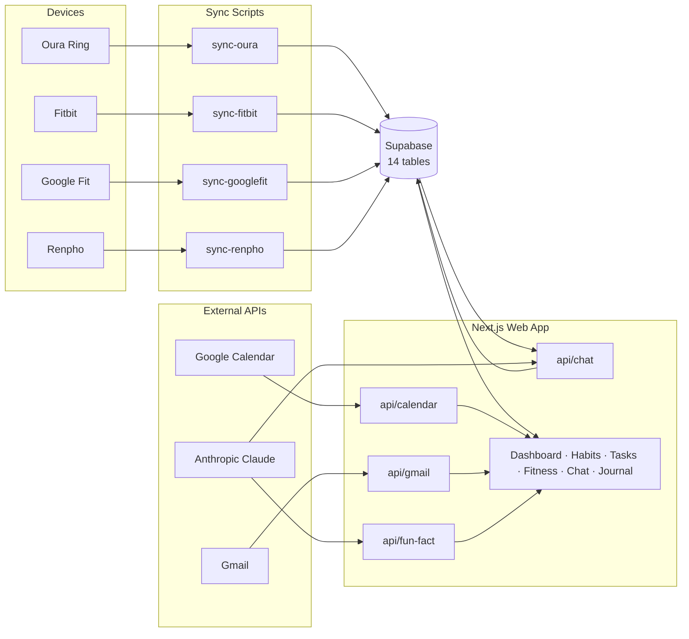

# Mr. Bridge — Personal Assistant

A personal AI assistant context layer for Claude Code. Syncs fitness, habit, and task data from external APIs into Supabase, delivers a structured session briefing, and tracks accountability across devices. Includes a full Next.js web interface for real-time access from any browser.

## Architecture



## Purpose

Mr. Bridge runs like infrastructure — structured over casual, quantified over qualitative, no filler. It pulls live data from Supabase at session start and delivers a concise brief before anything else. All live data is stored in the cloud and accessible from Claude Code, the web interface, or any device.

## File Structure

```
mr-bridge-assistant/
├── CLAUDE.md                              # Session bootstrap (loads rules via @path)
├── CHANGELOG.md
├── README.md
├── .env.example                           # Root env var template (Python scripts)
├── .gitignore
├── .mcp.json                              # MCP servers: DeepWiki (Google Calendar + Gmail via claude.ai hosted MCP)
├── .gitmodules
│
├── supabase/                              # Database schema + migrations
│   ├── config.toml
│   └── migrations/
│       ├── 20260410163801_initial_schema.sql
│       ├── 20260410164609_add_unique_constraints.sql
│       ├── 20260410170000_study_log_unique_constraint.sql
│       ├── 20260411000000_add_journal_entries.sql
│       └── 20260411000001_recovery_metrics_extended.sql
│
├── web/                                   # Next.js web interface (deployed on Vercel)
│   ├── .env.local.example                 # Web app env var template (Supabase, Anthropic, Google, timezone)
│   ├── src/
│   │   ├── app/
│   │   │   ├── (protected)/               # Auth-gated pages
│   │   │   │   ├── layout.tsx             # Protected layout with sidebar
│   │   │   │   ├── page.tsx               # Daily briefing dashboard
│   │   │   │   ├── tasks/page.tsx         # Task management
│   │   │   │   ├── habits/page.tsx        # Habit tracking — add/archive + 7/30/90d history
│   │   │   │   ├── fitness/page.tsx       # Body composition + workouts
│   │   │   │   ├── chat/page.tsx          # Mr. Bridge chat
│   │   │   │   └── journal/page.tsx       # Daily journal — guided 5-prompt flow
│   │   │   ├── api/
│   │   │   │   ├── chat/route.ts          # Claude API tool use (12 tools: tasks, habits, fitness, profile, Gmail, Calendar, recipes, meals)
│   │   │   │   ├── fun-fact/route.ts      # Claude Haiku daily fact + Supabase cache
│   │   │   │   └── google/
│   │   │   │       ├── calendar/route.ts  # Today's Google Calendar events
│   │   │   │       └── gmail/route.ts     # Important unread emails
│   │   │   └── login/page.tsx
│   │   ├── components/
│   │   │   ├── nav.tsx                    # Left sidebar (desktop labels / mobile icon rail)
│   │   │   ├── ui/
│   │   │   │   └── logo.tsx               # MB monogram SVG
│   │   │   ├── chat/                      # Chat UI with markdown rendering
│   │   │   ├── tasks/                     # Task CRUD components
│   │   │   ├── habits/                    # Habit toggle, add/archive UI, range-selectable history grid
│   │   │   ├── fitness/                   # Body comp chart (Recharts)
│   │   │   ├── journal/                   # Guided journal flow + history list
│   │   │   └── dashboard/
│   │   │       ├── fun-fact.tsx           # Daily fun fact card
│   │   │       ├── schedule-today.tsx     # Google Calendar card
│   │   │       ├── important-emails.tsx   # Gmail card
│   │   │       ├── recovery-summary.tsx   # Oura recovery & sleep card
│   │   │       ├── recovery-trends.tsx    # Sleep & readiness trend charts (Recharts)
│   │   │       ├── fitness-summary.tsx    # Body comp + last workout card
│   │   │       ├── inline-sparkline.tsx   # Mini trend sparkline (used in summary cards)
│   │   │       ├── habits-summary.tsx     # Today's habit progress card
│   │   │       ├── tasks-summary.tsx      # Active tasks card
│   │   │       └── recent-chat.tsx        # Last chat message card
│   │   └── lib/
│   │       ├── timezone.ts                # Timezone-aware date helpers (USER_TIMEZONE)
│   │       ├── supabase/                  # Client, server, service clients
│   │       └── types.ts                   # TypeScript interfaces for all DB tables
│   └── package.json
│
├── .claude/
│   ├── rules/
│   │   └── mr-bridge-rules.md             # Core behavioral rules + session protocol
│   ├── agents/
│   │   ├── nightly-postmortem.md          # 9pm habit check-in agent
│   │   ├── morning-nudge.md               # 8am session nudge agent
│   │   ├── weekly-review.md               # Sunday 8pm weekly summary agent
│   │   ├── study-timer.md                 # Study session timer agent
│   │   └── journal-reminder.md            # 7pm journal reminder (remote trigger)
│   ├── commands/
│   │   ├── log-habit.md                   # /log-habit slash command
│   │   ├── session-briefing.md            # /session-briefing slash command
│   │   ├── weekly-review.md               # /weekly-review slash command
│   │   └── stop-timer.md                  # /stop-timer slash command
│   ├── skills/
│   │   ├── send-notification/SKILL.md     # macOS push notification skill
│   │   └── log-habit/SKILL.md             # Habit logging skill (writes to Supabase)
│   ├── hooks/
│   │   └── scripts/hooks.py               # PostToolUse hook (Python 3)
│   ├── settings.json
│   └── references/
│       └── best-practice/                 # Submodule: shanraisshan/claude-code-best-practice
│
├── .github/
│   └── workflows/
│       └── weekly-review-nudge.yml        # Sunday 8pm ntfy.sh push (runs in cloud)
│
├── docs/
│   ├── notifications-setup.md             # Android, macOS, Windows ntfy setup guide
│   ├── fitness-tracker-setup.md           # Google Fit, Oura, Fitbit, Renpho setup
│   ├── google-oauth-setup.md             # OAuth token setup + refresh guide
│   └── gmail-multi-account.md            # POP3 aggregation + Calendar sharing setup (App Password, label ID resolution)
│
├── memory/                                # Local files (gitignored, archived originals)
│   ├── meal_log.md                        # Recipes — archived original; data lives in Supabase `recipes` table
│   ├── profile.template.md
│   ├── fitness_log.template.md
│   ├── meal_log.template.md
│   ├── todo.template.md
│   └── habits.template.md
│
├── scripts/
│   ├── _supabase.py                       # Shared Supabase client + urlopen_with_retry helper
│   ├── requirements.txt                   # Pinned Python dependencies
│   ├── fetch_briefing_data.py             # Queries Supabase → outputs session briefing data
│   ├── log_habit.py                       # Logs habit completions to Supabase
│   ├── migrate_to_supabase.py             # One-time migration: markdown → Supabase
│   ├── run-syncs.py                       # Parallel sync orchestrator (skip-if-recent logic)
│   ├── sync-googlefit.py                  # Google Fit weight → Supabase fitness_log
│   ├── sync-oura.py                       # Oura recovery metrics → Supabase recovery_metrics
│   ├── sync-fitbit.py                     # Fitbit workouts → Supabase workout_sessions
│   ├── sync-renpho.py                     # Renpho CSV → Supabase fitness_log (deprecated)
│   ├── check_birthday_notif.py            # Birthday push alerts from Google Calendar
│   ├── check_hrv_alert.py                 # HRV drop push alert (vs 7-day baseline)
│   ├── check_daily_alerts.py              # Task due-date push alerts
│   ├── notify.sh                          # Push notifications: macOS (osascript) + Android/Windows (ntfy.sh)
│   └── update-references.sh              # Pull latest best practices submodule
│
└── voice/                                 # Jarvis mode (voice interface)
    ├── bridge_voice.py                    # Wake word → STT → Claude API → TTS
    ├── config.py
    ├── requirements.txt
    └── README.md
```

> All live data (habits, tasks, fitness, recovery, recipes, meals) is stored in **Supabase** — not local files.

## Getting Started

### 1. Clone the repo
```bash
git clone --recurse-submodules https://github.com/<your-username>/mr-bridge-assistant.git
cd mr-bridge-assistant
```

### 2. Set up Supabase
1. Create a free project at [supabase.com](https://supabase.com)
2. Install the Supabase CLI: `brew install supabase/tap/supabase`
3. Link and push the schema:
```bash
supabase login
supabase link --project-ref <your-project-ref>
supabase db push
```

### 3. Set up environment variables
Two env files are required — one for Python scripts, one for the web app:

```bash
# Root — Python sync scripts
cp .env.example .env

# Web app — Next.js (Vercel reads .env.local)
cp web/.env.local.example web/.env.local
```

Fill in each value. See [docs/google-oauth-setup.md](docs/google-oauth-setup.md) for Google credentials, [docs/fitness-tracker-setup.md](docs/fitness-tracker-setup.md) for Oura/Fitbit, and [docs/notifications-setup.md](docs/notifications-setup.md) for `NTFY_TOPIC`.

### 4. Install Python dependencies
```bash
pip3 install -r scripts/requirements.txt
```

### 5. Migrate profile and recipes to Supabase
If you have existing markdown data files, migrate them to Supabase:
```bash
python3 scripts/migrate_to_supabase.py --dry-run   # preview first
python3 scripts/migrate_to_supabase.py             # migrate profile, recipes, habits, tasks, fitness
```
Or add profile data directly via the Supabase dashboard. Recipes populate the `recipes` table; the session briefing also reads `memory/meal_log.md` locally as a fallback until recipe display ships in the web interface.

### 6. Set up push notifications (Android, macOS, Windows)
See [docs/notifications-setup.md](docs/notifications-setup.md). Add `NTFY_TOPIC` as a GitHub Actions secret for the Sunday weekly review cloud nudge.

### 7. Connect Google Calendar + Gmail
Open Claude Code in the project directory, run `/mcp`, and authenticate with your Google account.

### 8. Open Claude Code in this directory
```bash
claude .
```
Mr. Bridge will sync fitness data, query Supabase, fetch calendar + Gmail, and deliver the session briefing.

> **First time?** If the Claude CLI isn't found: `npm install -g @anthropic-ai/claude-code`

## Session Workflow

1. Open Claude Code in this directory
2. Mr. Bridge syncs fitness APIs → queries Supabase → fetches calendar + Gmail
3. Session briefing delivered: schedule, emails, tasks, habit accountability
4. Use `/log-habit`, `/session-briefing` as needed during the session
5. Data writes go to Supabase automatically — no manual commit needed for data

## Slash Commands

| Command | Description |
|---------|-------------|
| `/log-habit [habits...]` | Log habit completions for today |
| `/session-briefing` | Re-run the full session briefing on demand |
| `/weekly-review` | Run the weekly habit + accountability summary |
| `/stop-timer` | Stop active study timer and log duration |

## Feature Development Workflow

Before starting any feature work:
```bash
bash scripts/update-references.sh   # pull latest best practices
git checkout -b feature/<name>
```

After implementation, open a PR — direct pushes to `main` are blocked by branch protection.
Feature backlog is tracked via GitHub Issues in your fork.

## Web Interface

A Next.js web app deployed on Vercel providing a full daily briefing UI:

- **Dashboard** — Bento grid (3-col lg): personalized greeting (name from Supabase profile) + readiness badge header; Fun Fact top banner (Claude Haiku); Schedule Today with multi-calendar support and past-event dimming; Important Emails with `work` badge for professional account; Upcoming Birthday card; Recovery & Sleep full-width card with HRV sparkline + 14-day trend charts; Body Comp / Recovery unified trends card (tabbed, 7d/30d/90d); Habit pills; Task list with priority colors
- **Chat** — streams responses from Claude Sonnet with markdown rendering
- **Tasks** — add, complete, and archive tasks
- **Habits** — daily check-in with blue toggle states, 7-day history grid
- **Fitness** — body composition chart (Recharts) + workout log
- **Journal** — guided daily reflection with 5 prompts (one at a time), progress bar, past entries history; 7 PM ntfy.sh reminder if not yet journaled

**Local development:**
```bash
cd web
npm install
npm run dev   # http://localhost:3000
```

Requires `web/.env.local` with:
```
NEXT_PUBLIC_SUPABASE_URL=...
NEXT_PUBLIC_SUPABASE_ANON_KEY=...
SUPABASE_SERVICE_ROLE_KEY=...
ANTHROPIC_API_KEY=...
GOOGLE_CLIENT_ID=...
GOOGLE_CLIENT_SECRET=...
GOOGLE_REFRESH_TOKEN=...
USER_TIMEZONE=America/Los_Angeles
```

## Voice Interface (Jarvis Mode)

See [voice/README.md](voice/README.md) for full setup. Requires Picovoice access key and `ANTHROPIC_API_KEY`.

```bash
pip install -r voice/requirements.txt
python voice/bridge_voice.py
```

## Changelog

See [CHANGELOG.md](CHANGELOG.md) for full version history.

---

<sub>Originally built by [Jason Leung](https://github.com/Theioz).</sub>
